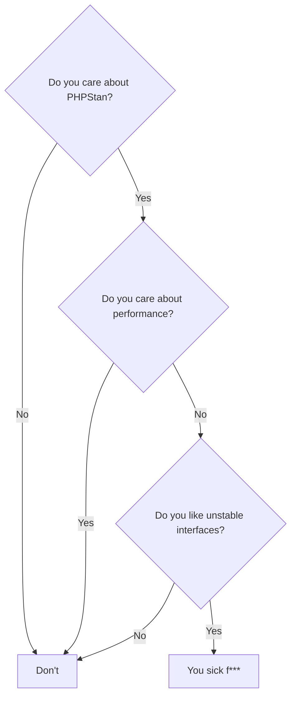

# No

It's unstable.

## Motivation

```php
/*
    - Mom, can we have type hinting?
    - We have type hinting at home.

    Type hinting at home:
*/

/**
 * @var array<string, int>
 */
private array $baseAmounts = [];

/**
 * @param array<string, int> $addedAmounts
 * @return array<string, int>
 */
public function plusAmounts(array $addedAmounts): array
{
    // ...
}
```

## Why not use something developed by 3rd party?

Yes, you should use something else. I wanted a bit of fun.

## Should I use it?


